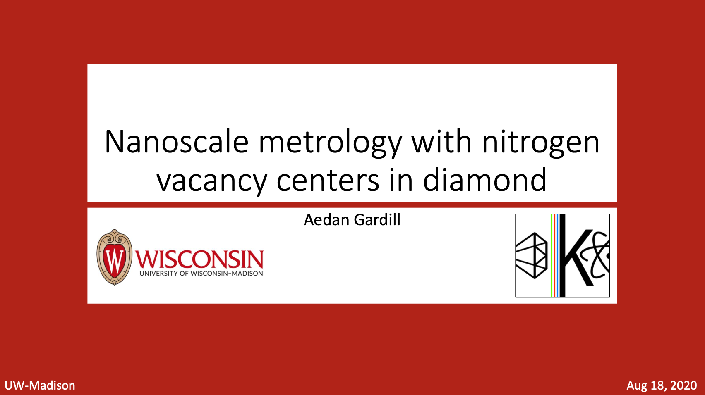
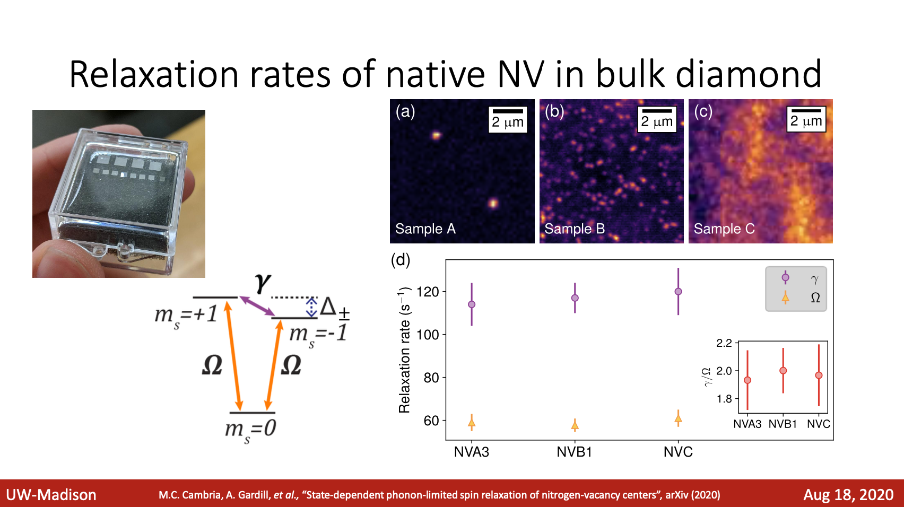

# Aedan Gardill

August 18, 2020

## Nanoscale Metrology with Nitrogen Vacancy Centers in Diamond

Nanoscale metrology has applications in fields ranging from industrial fabrication to biophysics to the study of complex condensed matter systems. 
Our group is developing novel sensing techniques with the nitrogen-vacancy (NV) center defect in diamond to enable local measurements of material properties and dynamics at the nanometer scale. 
Understanding the origins of decoherence in NVs is vital to unlocking their full potential for metrology. 
I will present recent work in which we have shed light on some of the NV decoherence sources intrinsic to diamond. 
These results bring us a step closer to using NVs to investigate the nature of decoherence in other quantum systems, such as solid-state qubit platforms.

<a href="https://rmorgan10.github.io/FROGS/AedanGardill/2020_08_18_AedanGardill.pdf" target="_blank">Link to talk PDF</a> 

