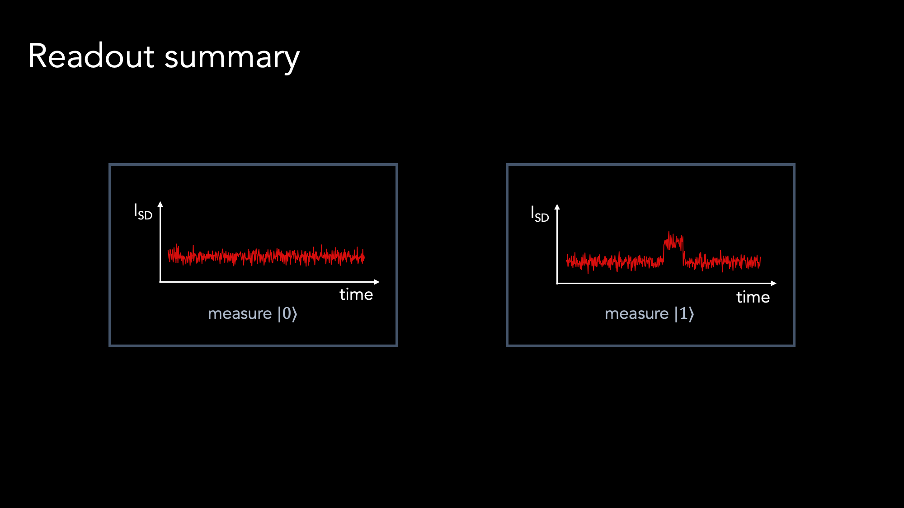
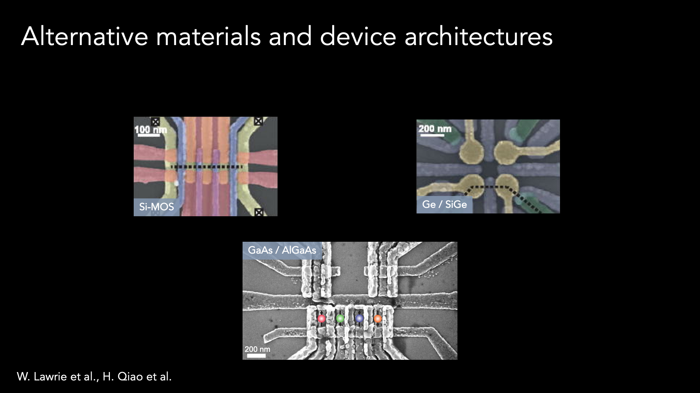

# Ben Harpt

September 1, 2020

## Quantum Computing with Individual Electrons

Computers built from bits that harness the properties of quantum physics have potential to solve problems that regular computers cannot. 
In recent years, prototype quantum computers have grown rapidly more capable thanks to progress in physics and engineering. 
Still, programming quantum computers to solve real-world problems remains a distant goal that depends largely on engineering the right hardware. 
In this FROGS talk, I explain how individual electron spins in semiconductors can be controlled and used as quantum bits to encode information. 
In broad strokes, I show how to prepare, manipulate, and read out these so-called spin qubits. 
I also highlight active research fronts in the quest to scale single qubits into functional quantum computers.

<a href="https://rmorgan10.github.io/FROGS/BenHarpt/harpt_NOGS.pdf" target="_blank">Link to talk PDF</a> 

