# Brent Mode

October 13, 2020

## Developing the Prototype Schwarzschild-Couder Telescope for the Cherenkov Telescope Array

As they speed through the Earth’s atmosphere, very high energy gamma rays have the potential to collide with an air molecule, setting off cascades of particle interactions which are detectable from a characteristic blue glow called Cherenkov light. 
While these interactions occur on much too short a time scale and produce light too faint for the human eye to observe, a breadth of science analyses become possible using a specially designed telescope with a powerful camera. 
My work at UW-Madison is focused on the development and commissioning of one such camera for the prototype Schwarzschild-Couder Telescope (pSCT) as part of the upcoming Cherenkov Telescope Array. 
I will describe the specifications of this novel instrument, the contributions I’ve made to the pSCT’s development, and touch on the science that will be possible once the pSCT is completed.

<a href="https://rmorgan10.github.io/FROGS/BrentMode/bmode_FROGS_13OCT2020.pdf" target="_blank">Link to talk PDF</a> 

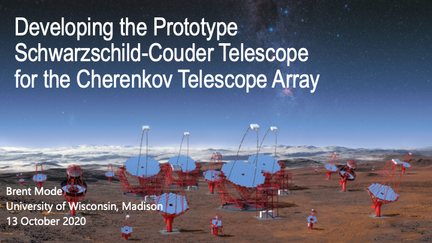

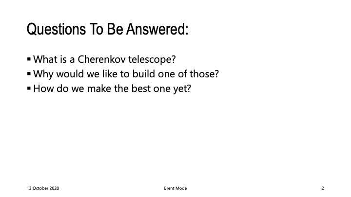

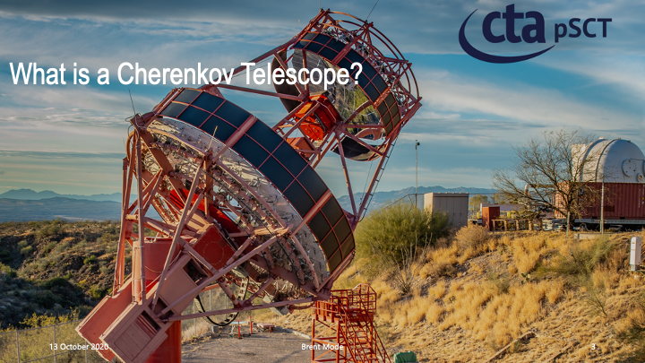

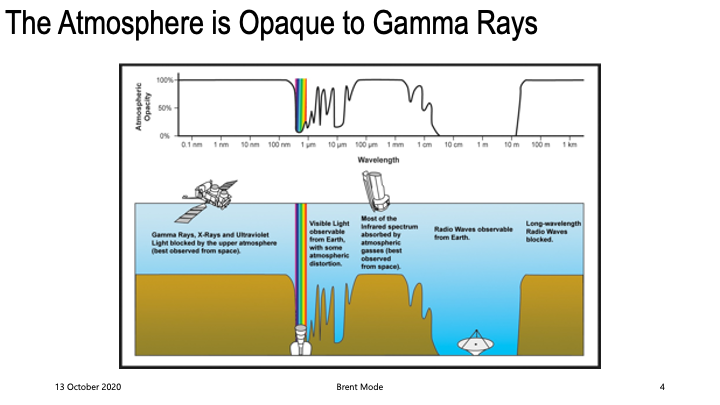

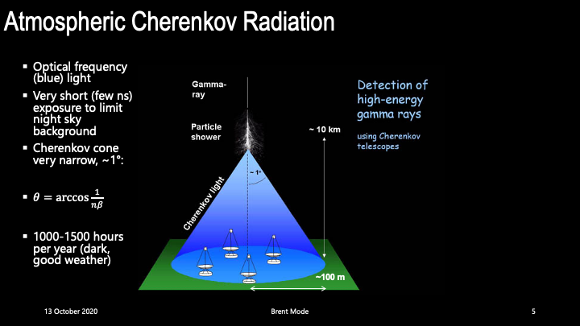

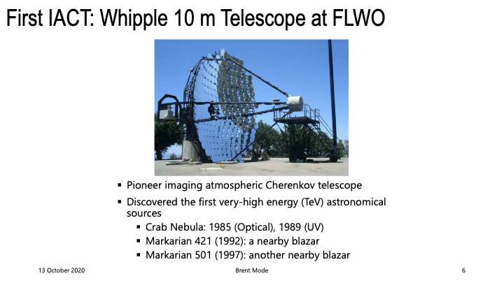

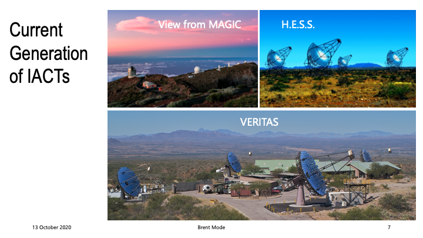

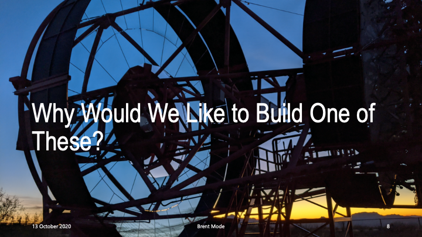

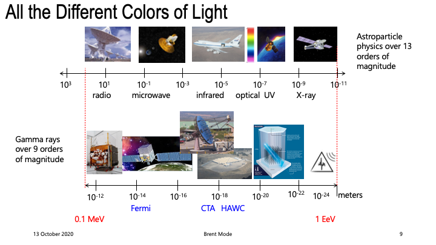

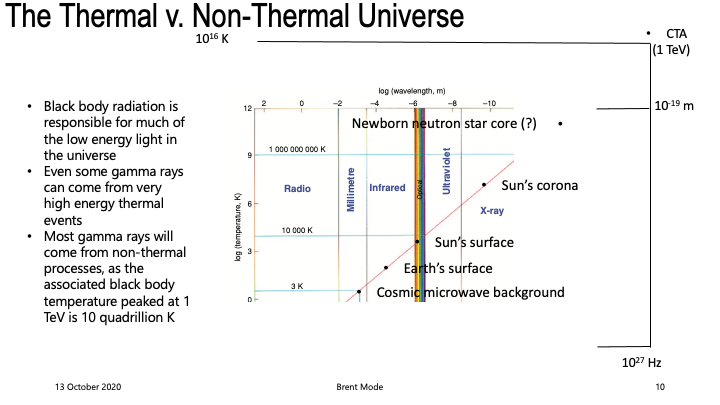

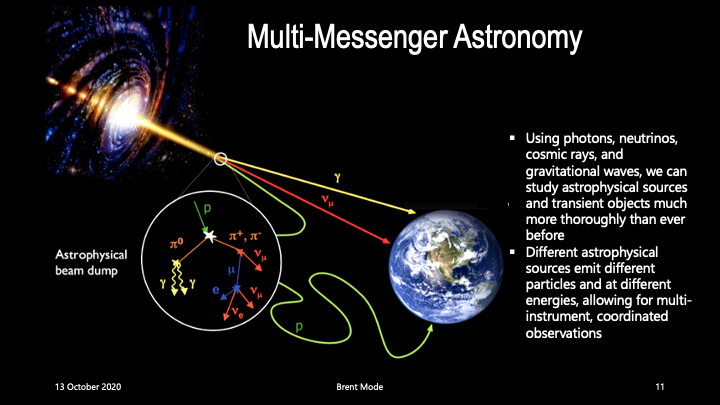

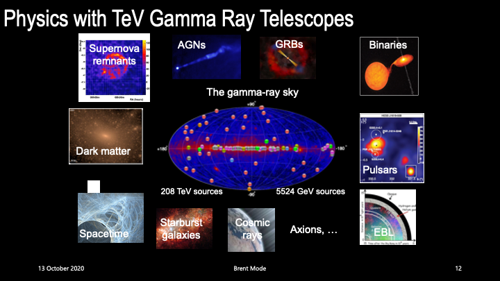

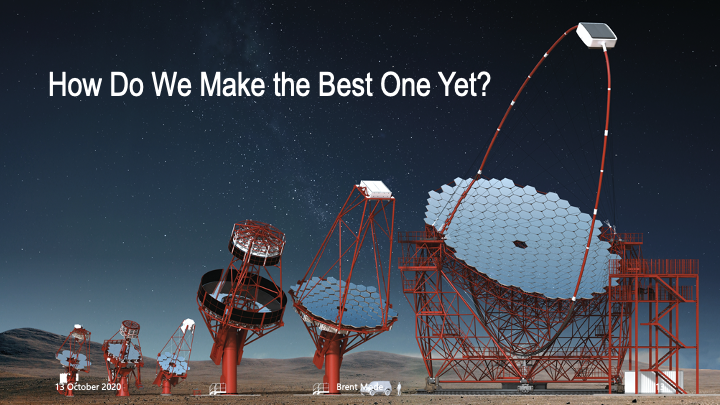

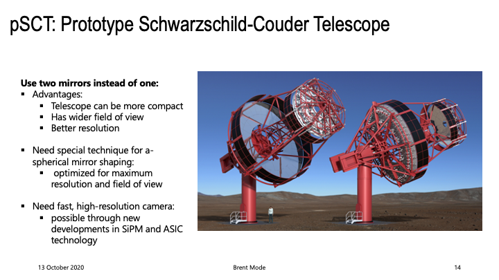

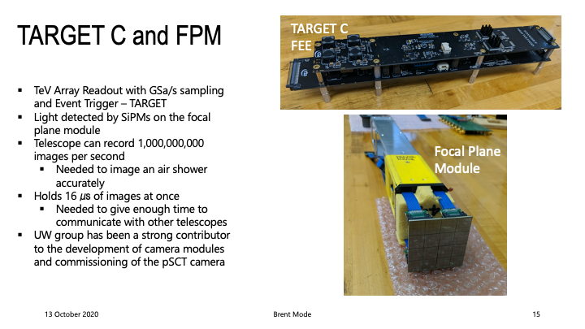

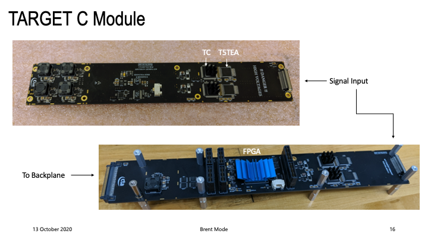

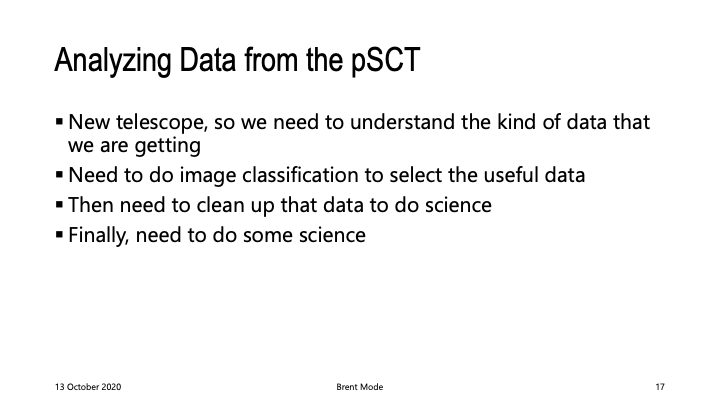

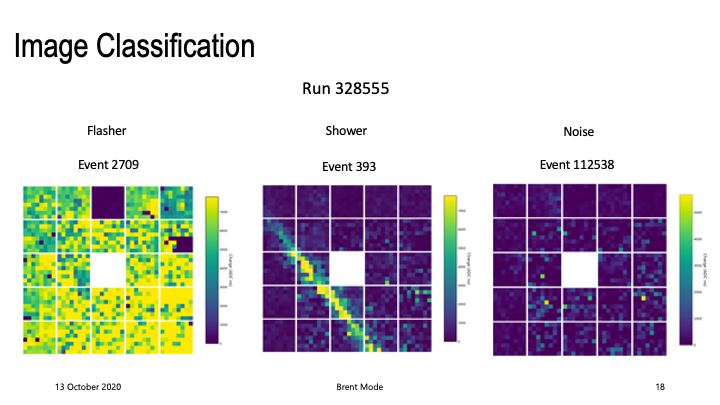

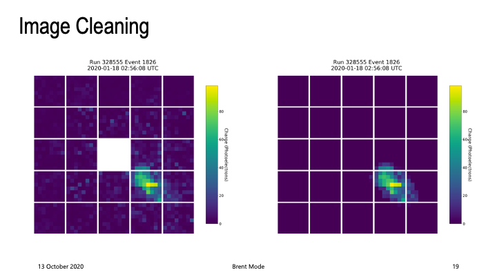

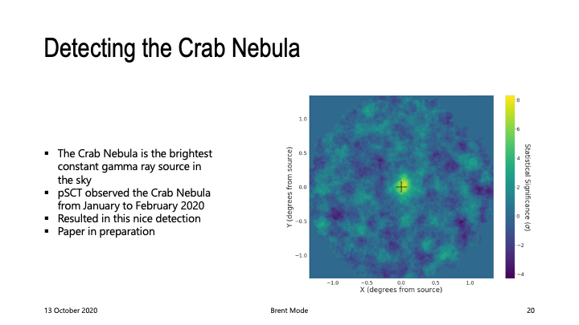

