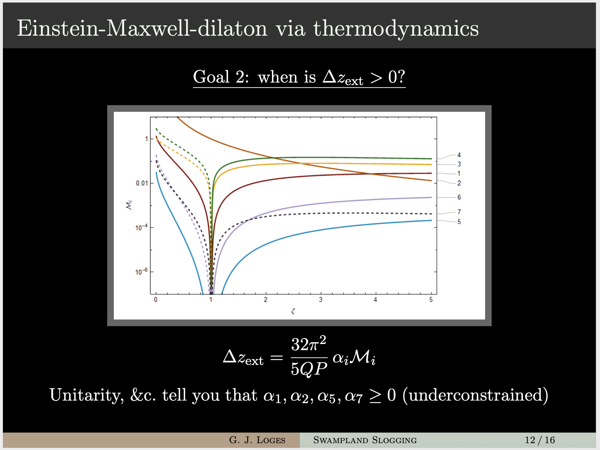

# Greg Loges

September 29, 2020

## Slogging through the Swampland

The Landscape of quantum gravity-derivable theories is surrounded on all sides by a vast, quantum gravity-incompatible Swampland. 
The aim of the Swampland program is to understand those features which can be used to distinguish these two different regions. 
In this talk I will give a brief introduction to recent progress in our understanding of quantum gravity and its implications for low-energy physics. 
I will focus on the weak gravity conjecture and present an overview of our recent work in which we use black hole thermodynamics to understand the role of symmetries in demonstrating the conjecture.

<a href="https://rmorgan10.github.io/FROGS/GregLoges/FROGS_swampland.pdf" target="_blank">Link to talk PDF</a>

