# Jimena Gonzalez

November 10, 2020

## Cosmography with Double Source Plane Lensing

One of the most popular theories that explain the accelerated expansion of the universe proposes the existence of a rare kind of energy that we call Dark Energy.
This energy acts like an "anti-gravity" and it makes about 70% of the universe total energy.
However, there is still a lot that we don't know about it and by understanding its nature we could learn more about the evolution of the universe.
The purpose of my research is to study dark energy by analyzing systems of Double Source Plane Lensing (DSPL).
These are very rare systems composed by a heavy foreground galaxy and two galaxies located behind, whose light gets deflected by the presence of the foreground galaxy and this can be perceived as pieces of double rings on the sky.
In this talk, I will explain why this novel approach is promising as a complementary method to more traditional methods, what we are doing to find DSPL systems in real data, and the future steps of the statistical analysis.

<a href="https://rmorgan10.github.io/FROGS/JimenaGonzalez/FROGS.pdf" target="_blank">Link to talk PDF</a>

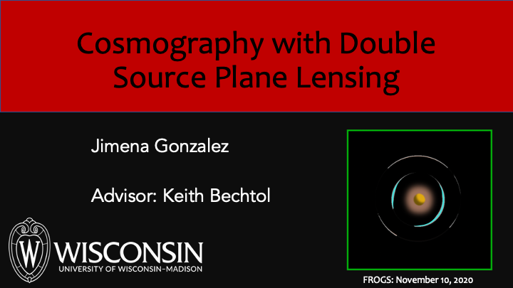

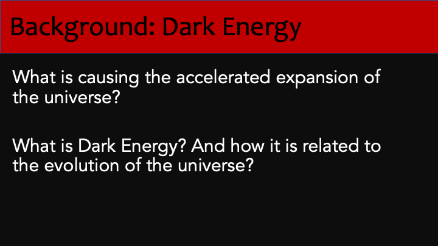

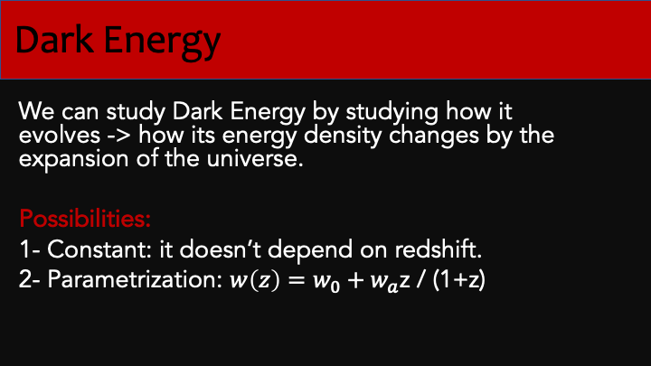

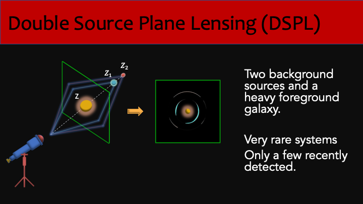

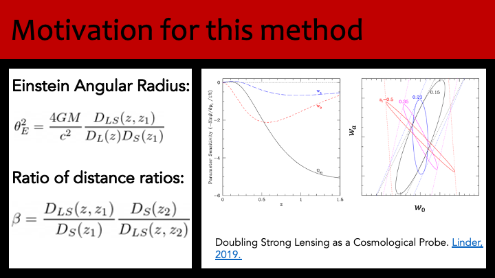

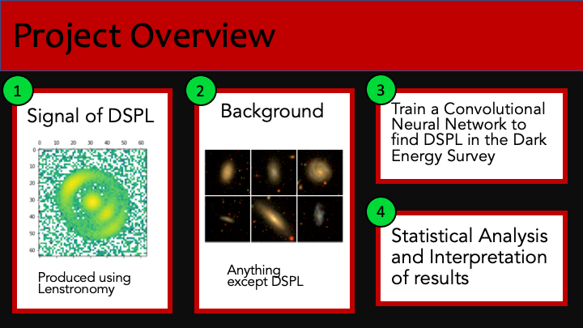

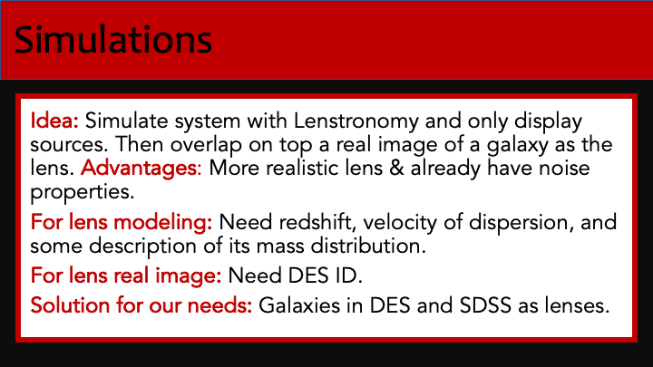

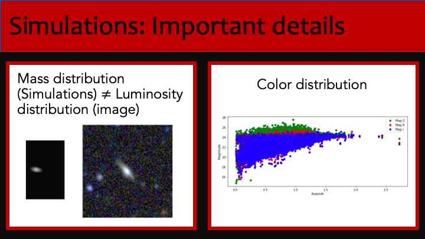

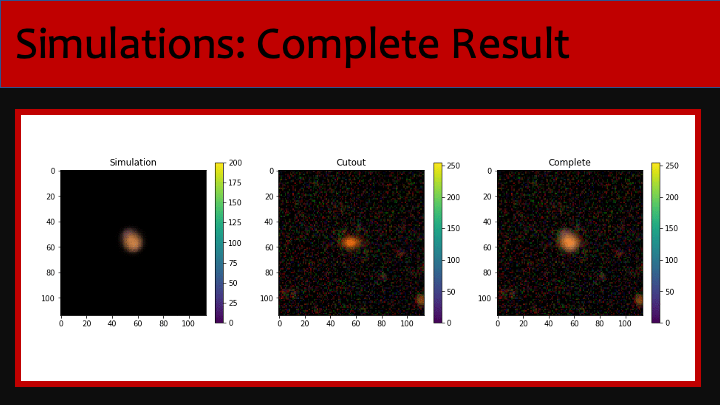

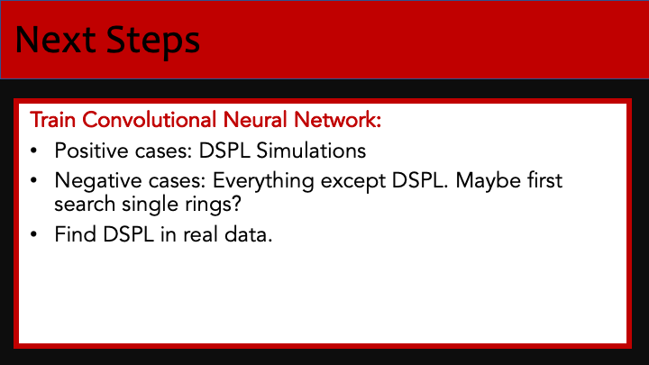

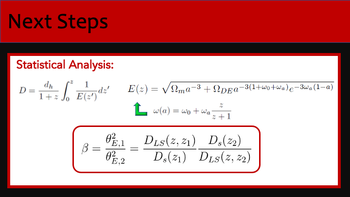

