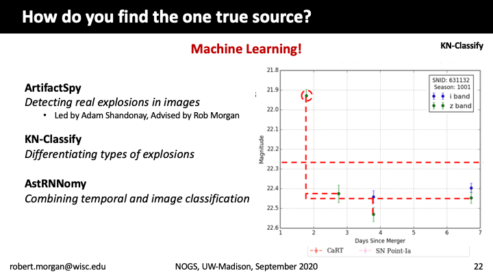
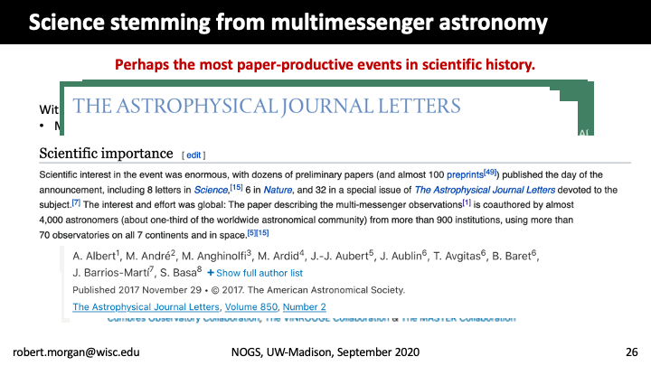

# Rob Morgan

September 17, 2020

## How to Find the Sources of Gravitational Waves and Astrophysical Neutrinos

Cataclysmic astronomical explosions send invisible messengers to Earth, such as extremely high-energy neutrinos and gravitational waves, that are detected all the time by instruments like IceCube and LIGO. 
The challenge in doing science with these messengers lies in the reality that these instruments cannot pinpoint the exact object in space that exploded: they can at best localize the explosion to an area on the sky roughly equivalent to the width of a couple of your fingers held at arm's length. 
The task of finding the exact source of the messenger falls to the electromagnetic astronomical community. 
In my work, I help operate and process images from the most powerful optical telescope ever built in real-time to search for light from these explosions. 
In this talk, I'll convey the thrill (anxiety) of working in real-time, overview the process of finding the sources of high-energy neutrinos and gravitational waves using machine learning, and outline the vast array of scientific analyses that can be done once these sources are found.

<a href="https://rmorgan10.github.io/FROGS/RobMorgan/Morgan_NOGS.pdf" target="_blank">Link to talk PDF</a>

