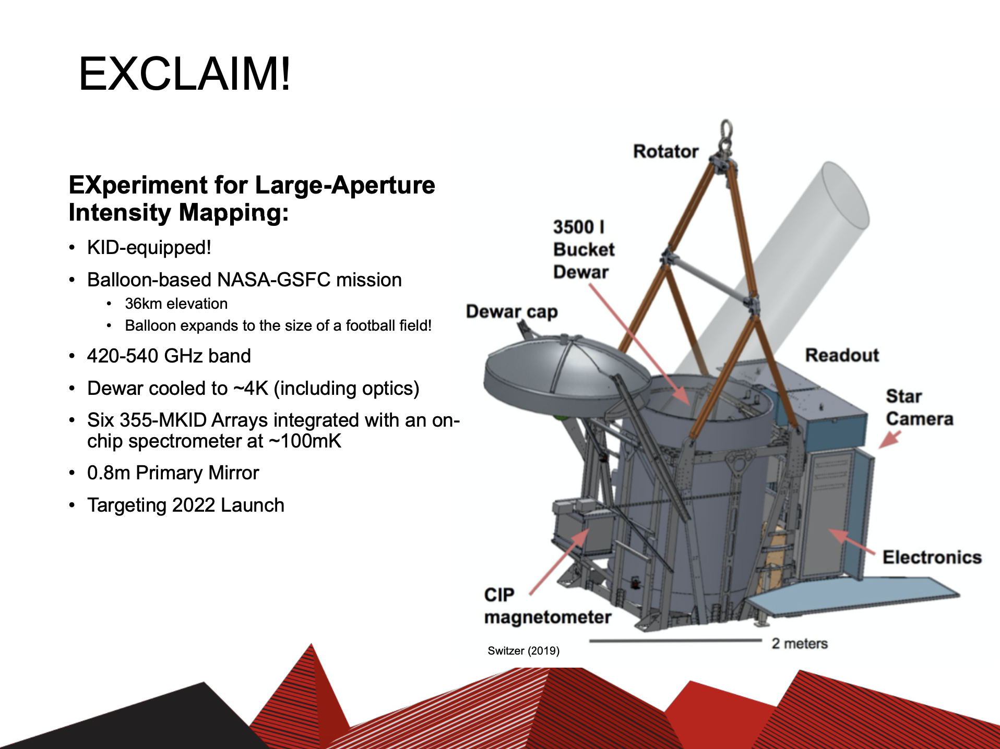

# Trevor Oxholm

October 27, 2020

## You’re Gonna Go Far, KID: cosmology with superconducting Kinetic Inductance Detectors on balloon- and space-based missions

Sub-millimeter astronomy is entering a new frontier. 
Earth’s atmosphere plagues ground-based sub-mm telescopes with high levels of background radiation, so astronomers are relocating their instruments to high-altitude balloons, and in the near future, onto satellites.
This new era of low-background sub-mm astronomy requires highly sensitive detector technologies, for which we turn to superconductivity. 
The Kinetic Inductance Detector (KID), a superconducting microresonator technology that has only recently seen its first light, is being commissioned for this new generation of instruments. 
The EXperiment for Cryogenic Large-Aperture Intensity Mapping (EXCLAIM), led by NASA-Goddard Space Flight Center scientists, is among the first in this class of instruments. 
I will describe the technology behind KIDs designed for EXCLAIM, and the science we plan to accomplish. 
I will also describe the potential for the use of KIDs in future space missions, along with the science that can be accomplished with such a low-background, highly sensitive survey of the cosmos.

<a href="https://rmorgan10.github.io/FROGS/TrevorOxholm/oxholm_FROGS_KIDS_cosmology.pdf" target="_blank">Link to talk PDF</a>

